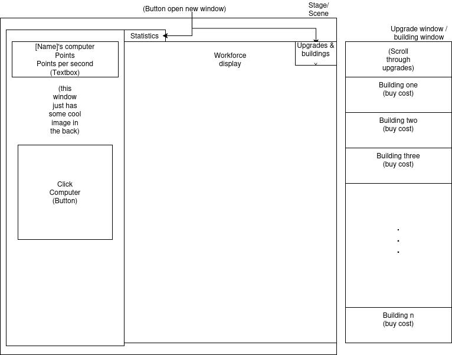
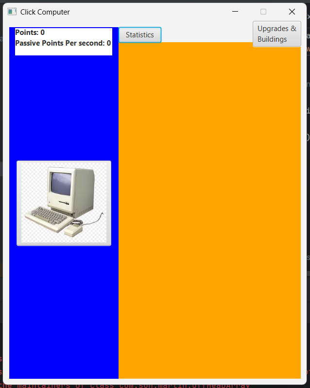
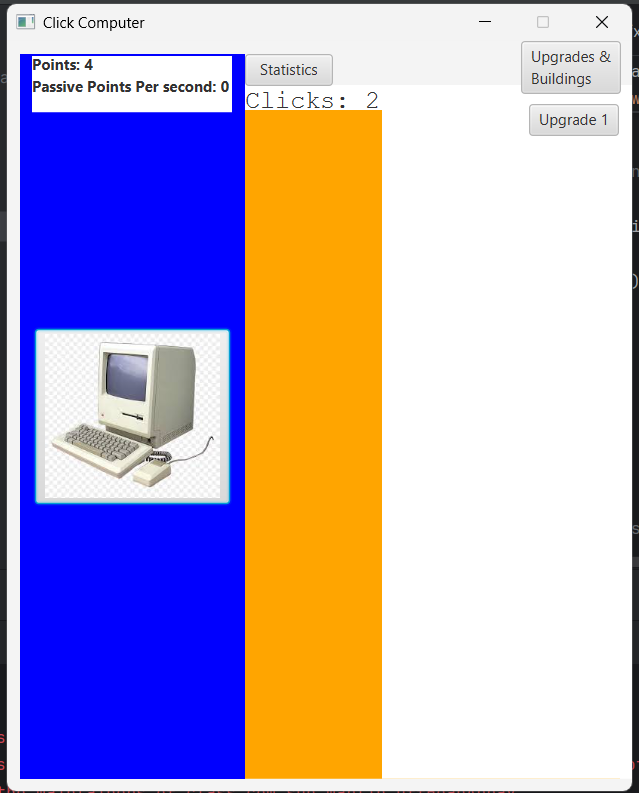

<h2>Scott Pickslay, Eduardo Martin, Alex Anderson, Calvin Pyke</h2>

## GUI Wireframe

## Program Running Photos

## What works so far?

As of this moment one working feature of the gui the menus as shown in the photos above.
When a button is pressed to open a menu (for instance, the buildings menu button) the program reveals all elements and activates them for use, and hides them when the button is clicked again.
I chose to mention this feature above all else because it uses an array of type Node to keep track of all elements we want to be "children" of the button.
The Node type is importantly the parent class of the elements, so using this array i can call Node's .setVisable() function and pass in the opposite of each childs current visablity.
So in short we have a extreamly easy to expand method of showing all children of a button.

